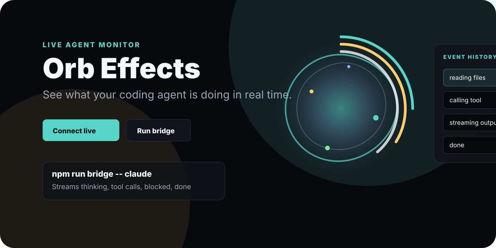

# Orb Effects



**A live activity orb for AI coding agents.**

Orb Effects shows what your agent is doing right now: reading, searching,
calling tools, streaming, waiting, blocked, or done.

No mystery spinner. No heavy dashboard. Just a tiny real-time agent heartbeat.

## Quick Start

Run the UI:

```bash
npm run start
```

Run the live bridge in another terminal:

```bash
npm run bridge
```

Open `http://127.0.0.1:5173` and click **Connect live agent**.

That is it.

## Watch Any Command

Wrap a coding agent or CLI command:

```bash
node bridge/orb-bridge.js claude
node bridge/orb-bridge.js codex
node bridge/orb-bridge.js npm test
```

Orb updates as the command starts, prints output, fails, or finishes.

## Why People Use It

- See if an agent is working or stuck.
- Show `waiting` and `blocked` states clearly.
- Make demos feel alive.
- Give users trust without exposing raw logs.
- Works with plain HTML, canvas, Node, and Server-Sent Events.

## Works With

Claude Code, Codex, Cursor wrappers, custom agents, test runners, browser
automation scripts, and any tool that can send JSON.

## Send Your Own Event

```bash
curl -X POST http://localhost:3000/event \
  -H "Content-Type: application/json" \
  -d "{\"state\":\"reading\",\"label\":\"Reading files\",\"detail\":\"Scanning src/\"}"
```

Supported states:

`thinking`, `reading`, `searching`, `tool_calling`, `streaming`, `waiting`,
`blocked`, `done`

## Embed Only The Orb

```html
<canvas id="orb"></canvas>
<script type="module">
  import { Orb } from "./orb.js";

  const orb = new Orb("#orb");

  orb.setEvent({
    state: "tool_calling",
    label: "Running tests",
    detail: "Checking the latest change.",
    priority: 0.8
  });
</script>
```

## If Port 3000 Is Busy

Windows PowerShell:

```bash
$env:ORB_PORT=3001; npm run bridge
```

Then connect Orb to:

```text
http://localhost:3001/events
```

## Docs

- [BRIDGE.md](./BRIDGE.md): connect agents and commands
- [MONITOR.md](./MONITOR.md): event stream contract

## Project Files

- `orb.js`: public export
- `agent-aura.js`: canvas renderer
- `monitor.js`: live event monitor
- `bridge/orb-bridge.js`: local bridge for agent events
- `index.html`: demo app

## License

MIT
